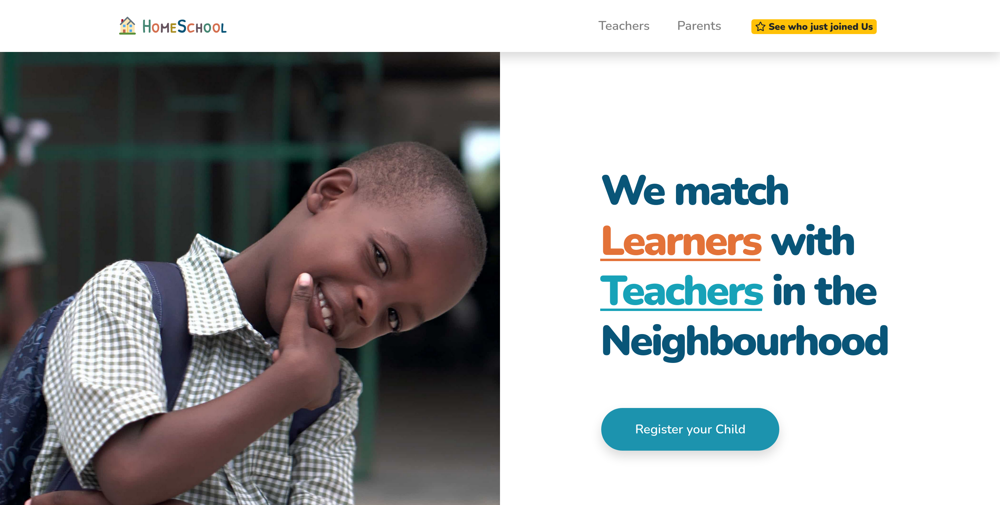

# Home School.

Homeschool matches teachers with students in a study-group in the same location. It uses Google Maps API to obtain their addresses. Students near each other are grouped in study-groups that are then matched with a teacher near them.

## Project live demo
[Live demo](https://homeschool.ug)

## About the project.
- Due to the increasing covid19 crisis currently in our country today, I considered working on a practical project solution that is related to our education crisis at present. 
- I got the project inspiration from Schoolhouse and I am building its functionality in regards our Ugandan school system.

## Project Requirements
- A parent can register a child (create a child/student account).
- A teacher cann create an account (create a teacher account).
- Account creation requires a full name, email address, and a password for both a teacher and child/student account.
- Both accounts require email verification to get activated.
- A user can update their profile after email verification. They should be able to upload their profile image, add their phone number, class, guardian's name(child/student account), and subject(teacher account).
- A user can add or update their address.
- Group registered children in study groups of 8 by determining distances between there locations. A student can be added to a group if their locations are relatively not more than 500 meters a part. This is achieved using the google maps places API and using the haversine formula to calculate the distance between each location from the longitude and latitudes.
- A teacher is allocated to an already formed study-group in the same locality.
- NOTE: Requirements for this project are evolving on every iteration, more are added as the project scales on.

## How to run this project

- Install Ruby.
- Install Ruby on Rails.
- Install bundle.
- Run "bundle install" inside the project  folder.
- Run "rails server" inside the project folder.
- Go to "https://localhost:3000/"

## Technologies Used
- Ruby on Rails
- Google maps API
- HTML5
- CSS3
- RSpec
- Bootstrap 4.5

## Test-driven development RSPEC

The code includes unit testing using RSpec. To start the test run `bundle exec rspec` in your terminal:

## Author

**Nakitto Catherine**
- Linkedin: [Nakitto Catherine](https://www.linkedin.com/in/nakitto-catherine2020)
- Github: [@Cathella](https://github.com/Cathella)
- Twitter: [@cathella9](https://twitter.com/cathella9)

## Show your support

Give a ⭐️ if you like this project!

## Enjoy!
